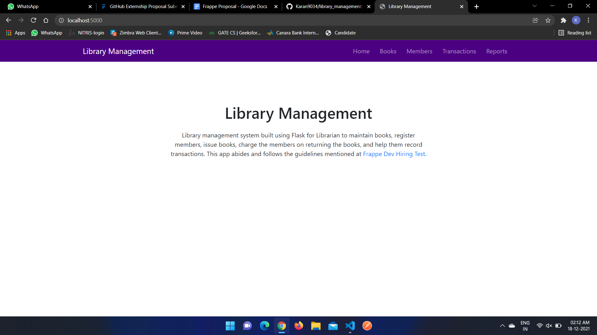

# Library Management App

## About

Library management system built using Flask for Librarian to maintain books, register members, issue books, charge the members on returning the books, and help them record transactions. This app abides and follows the guidelines mentioned at <a href="https://frappe.io/dev-hiring-test">Frappe Dev Hiring Test</a>. Built using Flask, Bootstrap 4, Jinja2 and SQLite.

## Instructions

1. Set up the .env file by renaming `.env.example` file to `.env` and adding a SECRET_KEY for the Flask application.
2. Create a virtual environment using:
```
python -m venv env
```
3. Install the dependencies using:
```
pip install -r requirements.txt
```
4. Set up the database using:
```
python setupDB.py
```
5. Run the application on `http://localhost:5000` by using:
```
python run.py
```

## Screenshots




